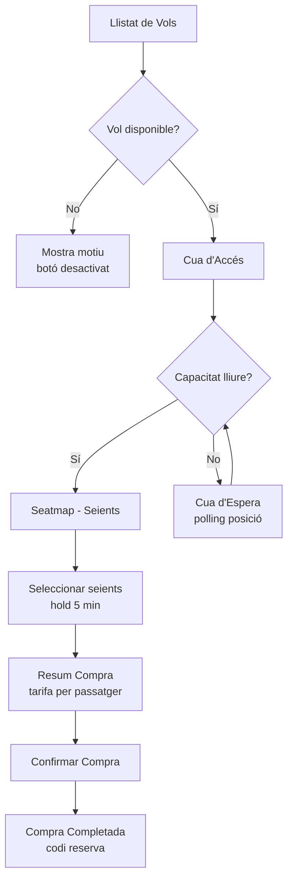

# 📖 Documentació Tècnica — BCNJET

## Índex
1. [Objectius](#objectius)
2. [Arquitectura](#arquitectura)
3. [Entorn de desenvolupament](#entorn-de-desenvolupament)
4. [Base de dades](#base-de-dades)
5. [API Backend — Endpoints](#api-backend--endpoints)
6. [Frontend — Vistes i Components](#frontend--vistes-i-components)
7. [Socket.IO — Temps Real](#socketio--temps-real)
8. [Flux de compra](#flux-de-compra)
9. [Comandes Artisan](#comandes-artisan)
10. [Desplegament a producció](#desplegament-a-producció)

---

## Objectius

BCNJET permet la compra de bitllets d'avió d'última hora des de BCN. L'objectiu és oferir una experiència fluida amb:
- Llistat de vols filtrable per finestra temporal (6H / 12H / 24H)
- Sistema de cua per gestionar la concurrència (capacitat configurable, ara 2 per a proves)
- Selecció de seients interactiva amb bloqueig temporal (hold de 5 min)
- Compra amb selecció de tarifa per passatger (general, nen, soci)
- Actualitzacions en temps real via Socket.IO

---

## Arquitectura

```
┌─────────────────┐     ┌──────────────┐     ┌────────────────┐
│   Frontend      │◄───►│  Backend API │◄───►│  MySQL (XAMPP)  │
│   Vue 3 + Vite  │     │  Laravel     │     │                │
│   Port 5173     │     │  Port 8000   │     └────────────────┘
└────────┬────────┘     └──────┬───────┘
         │                     │
         │   ┌─────────────┐   │
         └──►│ Socket.IO   │◄──┘
             │ Node.js     │
             │ Port 3001   │
             └─────────────┘
```

### Tecnologies
| Capa | Tecnologia | Versió |
|------|-----------|--------|
| Frontend | Vue 3 (SPA) | 3.x |
| Build | Vite | 6.x |
| State Management | Pinia | 3.x |
| Router | Vue Router | 4.x |
| Estils | TailwindCSS | 4.x |
| Backend | Laravel | 11.x |
| Autenticació | Sanctum | - |
| BD | MySQL | XAMPP |
| Temps real | Socket.IO | 4.x |
| Icones | Material Icons | CDN |

### Interrelació de components
- **Frontend → Backend**: Crides API REST via Axios (`http://localhost:8000/api/...`)
- **Frontend → Socket.IO**: Connexió WebSocket per actualitzacions de seients i cua
- **Backend → Socket.IO**: HTTP POST intern per notificar events (bloqueig seient, compra, etc.)
- **Backend → MySQL**: Eloquent ORM per a totes les operacions de dades

---

## Entorn de desenvolupament

### Requisits
- PHP 8.2+ (XAMPP)
- Composer
- Node.js 18+
- npm
- MySQL (XAMPP)

### Instal·lació

```bash
# Backend
cd backend
composer install
cp .env.example .env
php artisan key:generate
# Configurar BD a .env (DB_DATABASE, DB_USERNAME, DB_PASSWORD)
php artisan migrate:fresh --seed

# Frontend
cd frontend
npm install

# Socket.IO
cd socket-server
npm install
```

### Execució

```bash
# Terminal 1: Backend
cd backend
php artisan serve --port=8000

# Terminal 2: Frontend
cd frontend
npm run dev

# Terminal 3: Socket.IO (opcional)
cd socket-server
npm start
```

### Usuaris de prova
| Email | Contrasenya | Rol | esSoci |
|-------|------------|-----|--------|
| `admin@ultimahorabcn.cat` | `password` | admin | No |
| `soci@example.com` | `password` | usuari | Sí |

---

## Base de dades

### Diagrama de taules

```
users
├── id, name, email, password
├── rol (admin/usuari)
└── esSoci (boolean)

modelsAvio
├── id, nomModel
├── files, columnes, seientsTotals
└── descripcio

volsExternsCache (dades de l'API externa)
├── id, externalId
├── origenIata, destiIata, flightNumber, airline
├── dataHoraSortidaEstimada, dataHoraSortidaReal
├── estat (scheduled/delayed/cancelled)
└── rawJson

volsInterns (vols gestionats internament)
├── id, externalId
├── origenIata, destiIata, dataHoraSortida
├── estat (programat/retardat/cancel·lat)
├── modelAvioId → modelsAvio.id
├── capacitatCompra
└── maximBitlletsPerCompra

tarifes
├── id, nom (general/nen/soci)
├── preu, descripcio
└── activa (boolean)

controlCompraVol (control de concurrència)
├── id, volId → volsInterns.id
├── actius (compradors actius)
└── capacitat (màxim simultanis)

cuaCompraVol (tickets de cua)
├── id, volId → volsInterns.id
├── clientId (UUID del navegador)
├── posicio, estat (esperant/autoritzat/expirat/completat)
└── autoritzatA (timestamp d'autorització)

holdsSeients (bloqueigs temporals)
├── id, volId → volsInterns.id
├── clientId, fila, columna
└── expiraA (timestamp d'expiració, 5 min)

compres
├── id, volId → volsInterns.id
├── clientId, userId (nullable)
├── preuTotal, estat (confirmada)
└── codiReserva (únic)

bitllets
├── id, compraId → compres.id
├── volId, fila, columna
├── nomPassatger, tarifaId → tarifes.id
└── preu
```

---

## API Backend — Endpoints

### Autenticació

#### `POST /api/auth/registre`
Registrar un nou usuari.
```json
// Request
{ "name": "Nom", "email": "email@example.com", "password": "password", "password_confirmation": "password" }

// Response 201
{ "user": { "id": 1, "name": "Nom", "email": "email@example.com", "rol": "usuari", "esSoci": false }, "token": "1|abc..." }
```

#### `POST /api/auth/login`
```json
// Request
{ "email": "soci@example.com", "password": "password" }

// Response 200
{ "user": { "id": 2, "name": "Joan Soci", ... }, "token": "2|xyz..." }

// Response 401
{ "message": "Credencials incorrectes" }
```

#### `POST /api/auth/logout` 🔒
Requereix header `Authorization: Bearer {token}`.
```json
// Response 200
{ "message": "Sessió tancada" }
```

#### `GET /api/auth/perfil` 🔒
```json
// Response 200
{ "user": { "id": 2, "name": "Joan Soci", "email": "soci@example.com", "rol": "usuari", "esSoci": true } }
```

---

### Vols (públic)

#### `GET /api/vols`
Llistat de vols dins la finestra temporal.

| Paràmetre | Tipus | Default | Descripció |
|-----------|-------|---------|-----------|
| `finestraMinuts` | int | 1440 | Finestra en minuts (cutoff: 3h) |
| `desti` | string | null | Filtrar per codi IATA |

```json
// Response 200
{
  "vols": [
    {
      "id": 1,
      "origenIata": "BCN",
      "destiIata": "MAD",
      "dataHoraSortida": "2026-02-19 14:00:00",
      "estat": "programat",
      "modelAvio": "Airbus A320",
      "maximBitlletsPerCompra": 4,
      "externalId": "EXT-VY1001",
      "disponiblePerCompra": true,
      "motiuNoDisponible": null
    }
  ]
}
```

> **Nota**: `disponiblePerCompra` és `false` si el vol no té `controlCompraVol` o si l'estat no és `programat`/`retardat`. `motiuNoDisponible` conté el motiu.

#### `GET /api/vols/{id}`
Detall d'un vol amb informació del model d'avió.
```json
// Response 200
{
  "vol": {
    "id": 1,
    "origenIata": "BCN",
    "destiIata": "MAD",
    "dataHoraSortida": "2026-02-19 14:00:00",
    "estat": "programat",
    "maximBitlletsPerCompra": 4,
    "externalId": "EXT-VY1001",
    "disponiblePerCompra": true,
    "motiuNoDisponible": null,
    "modelAvio": {
      "id": 1,
      "nomModel": "Airbus A320",
      "files": 30,
      "columnes": 6,
      "seientsTotals": 180
    }
  }
}

// Response 404
{ "error": "Vol no trobat" }
```

#### `GET /api/tarifes`
```json
// Response 200
{
  "tarifes": [
    { "id": 1, "nom": "general", "preu": 49.99, "descripcio": "Tarifa estàndard per a adults" },
    { "id": 2, "nom": "nen", "preu": 24.99, "descripcio": "Tarifa infantil (50% descompte)" },
    { "id": 3, "nom": "soci", "preu": 39.99, "descripcio": "Tarifa especial per a socis (20% descompte)" }
  ]
}
```

---

### Cua (requereix `clientId`)

#### `POST /api/cua/{volId}/entrar`
Entrar a la cua de compra per un vol.
```json
// Request
{ "clientId": "uuid-del-navegador" }

// Response 200 (accés directe, no cal esperar)
{ "ticket": { "id": 1, "estat": "autoritzat", "posicio": 1, ... }, "tempsEstimat": 0 }

// Response 200 (cal esperar)
{ "ticket": { "id": 2, "estat": "esperant", "posicio": 2, ... }, "tempsEstimat": 120 }
```

#### `GET /api/cua/{volId}/posicio?clientId={clientId}`
Consultar posició actual a la cua.
```json
// Response 200
{ "ticket": { "id": 1, "estat": "autoritzat", "posicio": 1 }, "davanters": 0 }

// Response 404
{ "error": "No tens ticket per aquest vol" }
```

#### `POST /api/cua/{volId}/sortir`
```json
// Request
{ "clientId": "uuid-del-navegador" }

// Response 200
{ "message": "Has sortit de la cua" }
```

---

### Compra / Seients (requereix `clientId`)

#### `GET /api/compra/{volId}/seatmap?clientId={clientId}`
Obtenir mapa de seients amb estat de cada seient.
```json
// Response 200
{
  "vol": { "id": 1, "files": 30, "columnes": 6, ... },
  "seients": {
    "5-2": { "estat": "lliure" },
    "5-3": { "estat": "meu" },
    "10-1": { "estat": "ocupat" },
    "10-4": { "estat": "bloqueig_altri" }
  }
}
```

Estats dels seients:
| Estat | Descripció |
|-------|-----------|
| `lliure` | Disponible per seleccionar |
| `meu` | Bloquejat per l'usuari actual |
| `ocupat` | Ja comprat |
| `bloqueig_altri` | Bloquejat per un altre usuari |

#### `POST /api/compra/{volId}/bloquejar`
Bloquejar un seient temporalment (hold de 5 min).
```json
// Request
{ "clientId": "uuid", "fila": 5, "columna": 3 }

// Response 200
{ "message": "Seient bloquejat", "expiraA": "2026-02-19T12:05:00" }

// Response 409
{ "error": "Seient ja ocupat o bloquejat" }
```

#### `POST /api/compra/{volId}/alliberar`
```json
// Request
{ "clientId": "uuid", "fila": 5, "columna": 3 }

// Response 200
{ "message": "Seient alliberat" }
```

#### `POST /api/compra/{volId}/confirmar`
Confirmar la compra amb tots els seients bloquejats.
```json
// Request
{
  "clientId": "uuid",
  "passatgers": [
    { "fila": 5, "columna": 3, "nomPassatger": "Joan Garcia", "tarifaId": 1 },
    { "fila": 5, "columna": 4, "nomPassatger": "Maria Garcia", "tarifaId": 2 }
  ]
}

// Response 200
{
  "message": "Compra confirmada",
  "compra": {
    "id": 1,
    "codiReserva": "BCN-AB1234",
    "preuTotal": 74.98,
    "bitllets": [
      { "id": 1, "fila": 5, "columna": 3, "nomPassatger": "Joan Garcia", "preu": 49.99 },
      { "id": 2, "fila": 5, "columna": 4, "nomPassatger": "Maria Garcia", "preu": 24.99 }
    ]
  }
}

// Response 400
{ "error": "No tens seients bloquejats" }
```

> **Seguretat**: Els preus es resolen servidor-side a partir de `tarifaId`. El client no pot enviar preus personalitzats.

---

### Admin 🔒 (requereix `auth:sanctum` + rol `admin`)

#### `GET /api/admin/models-avio`
```json
// Response 200
{ "modelsAvio": [ { "id": 1, "nomModel": "Airbus A320", "files": 30, "columnes": 6, "seientsTotals": 180 } ] }
```

#### `POST /api/admin/models-avio`
```json
// Request
{ "nomModel": "Boeing 787", "files": 40, "columnes": 9, "seientsTotals": 290, "descripcio": "Avió de fuselatge ample" }
```

#### `PUT /api/admin/models-avio/{id}`
Actualitzar un model d'avió.

#### `DELETE /api/admin/models-avio/{id}`
Eliminar un model d'avió.

#### `GET /api/admin/vols-interns`
Llistat de tots els vols interns.

#### `POST /api/admin/vols-interns`
```json
// Request
{ "externalId": "EXT-NEW01", "origenIata": "BCN", "destiIata": "MAD", "dataHoraSortida": "2026-02-20 10:00:00", "estat": "programat", "modelAvioId": 1, "capacitatCompra": 5, "maximBitlletsPerCompra": 4 }
```

#### `PUT /api/admin/vols-interns/{id}`
Actualitzar un vol intern.

#### `DELETE /api/admin/vols-interns/{id}`
Eliminar un vol intern.

#### `GET /api/admin/monitoritzacio`
Dashboard amb estadístiques del sistema.

---

## Frontend — Vistes i Components

### Rutes

| Ruta | Vista | Descripció |
|------|-------|-----------|
| `/` | `LoginView` | Login/Registre amb autenticació |
| `/vols` | `VolsLastMinuteView` | Llistat de vols filtrable |
| `/vol/:id/cua` | `CuaAccesView` | Explicació de la cua i botó d'entrada |
| `/vol/:id/esperant` | `CuaEsperaView` | Pantalla d'espera amb posició a la cua |
| `/vol/:id/seients` | `SeatmapView` | Mapa de seients interactiu 🔒 |
| `/vol/:id/resum` | `ResumCompraView` | Resum amb selecció de tarifa/passatger 🔒 |
| `/compra/:id/completada` | `CompraCompletadaView` | Confirmació de compra amb codi |
| `/sessio-expirada` | `SessioExpiradaView` | Sessió expirada |

> 🔒 = Requereix ticket de cua autoritzat (navigation guard)

### Components
| Component | Descripció |
|-----------|-----------|
| `AppHeader` | Capçalera amb navegació i estat d'autenticació |
| `VolCard` | Targeta de vol amb countdown, badge de disponibilitat |
| `CountdownTimer` | Comptador enrere fins a la sortida del vol |
| `ToastNotification` | Notificacions toast globals (provide/inject) |

### Stores (Pinia)
| Store | Descripció |
|-------|-----------|
| `authStore` | Autenticació, login, logout, registre, gestió de clientId |
| `volsStore` | Llistat de vols, detall, tarifes |
| `cuaStore` | Gestió de la cua (entrar, consultar posició, sortir) |
| `compraStore` | Seatmap, holds, confirmació, integració Socket.IO |

### Serveis
| Servei | Descripció |
|--------|-----------|
| `api.js` | Instància Axios configurada (`baseURL`, interceptors) |
| `socketService.js` | Connexió Socket.IO, rooms per vol, events |

---

## Socket.IO — Temps Real

### Servidor
Arxiu: `socket-server/index.js` — Port 3001

### Events client → servidor
| Event | Dades | Descripció |
|-------|-------|-----------|
| `join-flight` | `{ flightId }` | Unir-se a la room del vol |
| `leave-flight` | `{ flightId }` | Sortir de la room del vol |

### Events servidor → client
| Event | Dades | Descripció |
|-------|-------|-----------|
| `seatmap-updated` | `{ seients }` | Actualització del mapa de seients |
| `user-joined` | `{ count }` | Nombre d'usuaris connectats al vol |
| `user-left` | `{ count }` | Nombre d'usuaris connectats al vol |
| `queue-updated` | `{ posicio }` | Actualització de posició a la cua |

### API interna (Backend → Socket.IO)
```
POST http://localhost:3001/emit
Body: { "room": "flight-{volId}", "event": "seatmap-updated", "data": { ... } }
```

---

## Flux de compra



### Finestra temporal
- **Cutoff mínim**: 3 hores abans de la sortida (temps per arribar a l'aeroport: ~40min transport + ~40min seguretat + ~15min porta + ~30min tancament + ~15min marge)
- **Finestra màxima**: 24 hores (per defecte)
- **Filtres frontend**: 6H / 12H / 24H

### Seguretat
- Preus resolts servidor-side a partir de `tarifaId`
- `clientId` (UUID) identifica cada navegador
- Navigation guards protegeixen rutes que requereixen ticket
- Holds de seients expiren automàticament als 5 minuts
- Comanda `NetejarHoldsExpirats` s'executa cada minut

---

## Comandes Artisan

| Comanda | Descripció |
|---------|-----------|
| `php artisan vols:reseed` | Regenera vols per avui i demà (manté usuaris i tarifes) |
| `php artisan migrate:fresh --seed` | Reset complet de tota la BD |

### Vols de prova generats
- **Avui**: 21 vols (07:00 – 19:30) amb diverses aerolinies i destins
- **Demà**: 11 vols (07:00 – 14:00)
- **Capacitat de cua**: 2 persones simultànies (configurable al seeder)

---

## Desplegament a producció

### Build del frontend
```bash
cd frontend
npm run build
# Genera /dist amb els arxius estàtics
```

### Configuració Laravel
```bash
# Configurar .env amb BD de producció
APP_ENV=production
APP_DEBUG=false
APP_URL=https://domini.cat

# Optimitzar
php artisan config:cache
php artisan route:cache
php artisan view:cache
```

### Socket.IO en producció
```bash
cd socket-server
SOCKET_PORT=3001 node index.js
# O amb PM2: pm2 start index.js --name socket-server
```
